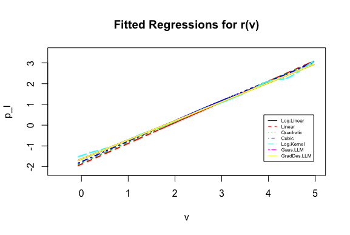

``` {r setup, echo = FALSE, message = FALSE, warnings = FALSE}
library(knitr)
library(tidyverse)
knitr::opts_chunk$set(
  collapse = TRUE,
  warning = FALSE,
  message = FALSE,
  echo = FALSE,
  comment = "#>",
  fig.path = "../figures")
```

A reference implementation of:

> Epple, Dennis, Brett Gordon, and Holger Sieg. 2010. *"A New Approach to Estimating the Production Function for Housing."* American Economic Review, 100 (3): 905-24.DOI: 10.1257/aer.100.3.905

# Introduction

The purpose of the paper is to do a replication of the paper "A New Approach to Estimating the Production Function for Housing" [@epple2010new] that estimates the production function for housing. Based on two factors - the observed variation in land prices and housing values per unit of land, the original paper has provided an algorithm to identify the housing supply function per unit of land. This in turn is used to derive an estimate of the underlying production function. The approach yielded plausible estimates for the price elasticity of housing supply per unit of land, based on data from Allegheny County in Pennsylvania. In the paper,we propose a reference implementation by adding two additional models to replicate an estimation function that relates land price and home value per unit land and produce the corresponding tables and plots.Estimating housing production functions is challenging, as the quantity and price per unit of the housing services are not observed by the econometrician. Replicating the study helps us to understand how the underlying production function is estimated by treating prices and quantities of housing services as latent variables, without relying on strong functional form assumptions.


# Methods

The current methodology provided by the author for estimating house price supply function uses parametric models. The author in the paper aims to establish a function $r(\nu)$ which relates land price $(p_l)$ and home value per unit land $(\nu)$. The parametric functions used for the purpose is OLS with different variations in it. The paper has used multiple transformation on data to produce linear, log linear and polynomial linear models to best identify the relation.
 
Since, the function $r(\nu)$ forms the root of further analysis and calculation, it is imperative that we replicate the study of these models to test the robustness and the assumptions behind the models. 
We decided to split the method of implementation in two direction. The first method is to use a different model for replication and the other is changing the loss function used in the model.
 
For the first case of different model, we decided use Generalized Linear Model with different distribution families. Using different families allows us to verify the condition of normality of error in the models used by authors. We noticed that the gaussian distribution family with log independent and dependent variable produced a line that fitted the best with the data and the corresponding coefficients were very similar to the log linear model used by the author.

In the case of different loss function, we wrote a function code to implement log linear regression with gradient descent loss function. The gradient descent loss function provides a more flexible approach because of the presence of hyperparameters *learning rate* and *number of iteration*. The author of the paper has not explored this methodology, therefore we had no information about the value of hyperparameters *learning rate* and *number of iteration*, therefore we ran a simulation study to determine the hyperparameters that delivered values of coefficients very similar to that of the models used by the author

The paper uses Ordinary Differential Equations for calculating the supply functions, $s(p)$. For this package 'odesolve' has been used in the base paper. Package ‘odesolve’ has been removed from the CRAN repository. The more recent package 'deSolve' completely supersedes odesolve and we have installed the same.

The paper uses linear function in estimating the coefficients of alpha, beta and gamma in the HNIP estimator. The linear model is realized using Ordinary Least Squares (OLS) method. The estimator is replicated by replacing the OLS based linear function with a bayesian regression function. Bayesian linear regression is used because it is more flexible to further model development and can directly model posteriors of derived/calculated quantities. "Bolstad" package provides a bayes.lm function which has been used to complete the replication. Upon analysis, we can conclude that the the replicated estimator produced coefficients that are similiar to the actual paper. 


# Results

The original paper had estimated the r(v) function which characterizes the relationship between the price of land and the value of housing per unit of land. Using OLS for log-linear, linear, quadratic and cubic models, it reports the estimates of the equilibrium locus. We have replicated the same results using gaussian log-linear model and gradient descent log linear model.  Results are enclosed in Table 1. For both of these two models, they fit the main features of the residential data substantially well and their performance is similar to the earlier four models. All the p-values were calculated using heteroskedasticity-robust standard errors and they were significant at 1% level. For effective and comprehensive comparisons of all the six models used, we have also enclosed a plot of all our six models. Please refer to figure 1. As iterated, we see r(v) functions form all the six models yielding similarly shaped slopes. We were able to establish the monotonicity condition of $r(\v)$ to be satisfied for the two replication models as well under all the polynomial estimation cases for the range of values of v observed in the data.

From the base paper, the log linear models establishes the change in value of land (variable: v) with unit change in land price (variable: pland). It calculates of slope to be $log(\v)$ as 0.909 and the intercept coefficient as -1.605. Upon replicating the same intentions through Generalized Log Linear Model, we get the slope to be 0.9186 and the intercept as -1.63. the slope and intercept coefficient from Gradient Descent Log Linear Model are 0.9184 and -1.6311 respectively. Thus, we observe similar performance in calculating the housing per unit of land from all of them. 

``` {r, echo = FALSE, message = FALSE, warnings = FALSE, results = 'asis'}
table <- read.csv('./ReproducedTable.csv', header = T, na.strings = '__')
colnames(table) = gsub("_", " ", colnames(table))
table[is.na(table)]<- " "
kable(table, caption = "Table")
```

``` {r my-fig, fig.cap = "Rplot_with_AllModel"}

```

# Conclusion

# References

1.@epple2010new

